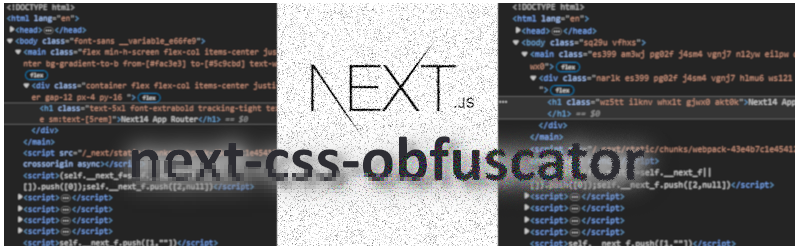

# NEXT-CSS-OBFUSCATOR

Project starts on 30-10-2023

 [](LICENSE)&nbsp;&nbsp;&nbsp;[](https://github.com/soranoo/Donation)

[](https://github.com/soranoo/next-css-obfuscator)

[](https://www.npmjs.com/package/next-css-obfuscator) [](https://www.npmjs.com/package/next-css-obfuscator)

---

Visit the [GitHub Page](https://github.com/soranoo/next-css-obfuscator/) for better reading experience and latest docs. 😎

--- 


### 🎉 Version 2.1.0 has NOW been released 🎉
  Shout out to [hoangnhan2ka3](https://github.com/hoangnhan2ka3) for providing a 💪wonderful [issue](https://github.com/soranoo/next-css-obfuscator/issues/6) report and a demo site. 

  #### 📌 Changes
  - Much Much Much better quality of CSS selector obfuscation
  - Delete original CSS automatically after obfuscation (only apply at full obfuscation)
  - Support TailwindCSS Universal Selector (eg. `*:pt-4`)
  - More tests

  #### 📌 Configuration Changes
  - Removed `customTailwindDarkModeSelector` option, the dark mode selector will be automatically obfuscated at full obfuscation.
  - Merged `includeAnyMatchRegexes` and `excludeAnyMatchRegexes` options into `whiteListedFolderPaths` and `blackListedFolderPaths` options. (Directly move the regexes to the `whiteListedFolderPaths` and `blackListedFolderPaths` options)
  - Added `removeOriginalCss` option, default to `false`. Set to `true` to delete original CSS from CSS files if it has a obfuscated version.
  - `classIgnore` option now supports Regex.

### 💥 Version 2 (Major Update)
  This version is deeply inspired by [PostCSS-Obfuscator](https://github.com/n4j1Br4ch1D/postcss-obfuscator). Shout out to [n4j1Br4ch1D](https://github.com/n4j1Br4ch1D) for creating such a great package and thank you [tremor](https://github.com/tremorlabs) for sponsoring this project.

  #### 📌 Changes
  - Support basic partial obfuscation
  - Support TailwindCSS Dark Mode
  - New configuration file `next-css-obfuscator.config.cjs`
  - More configuration options
  - Now become a independent solution (no need to patch `PostCSS-Obfuscator` anymore)
  - More tests
  - Better CSS parsing
  
### 📚 Migration Guides
- [Migrate from version 1.x to 2.x](docs/upgrade-to-v2.md)


[version 1.x README](https://github.com/soranoo/next-css-obfuscator/tree/v.1.1.0)

Give me a ⭐ if you like it.

## 📖 Table of Contents

- [🤔 Why this?](#-why-this)
- [💡 How does it work?](#-how-does-it-work)
  - [Where is the issue in PostCSS-Obfuscator?](#where-is-the-issue-in-postcss-obfuscator)
  - [How does this package solve the issue?](#how-does-this-package-solve-the-issue)
  - [How does this package work?](#how-does-this-package-work)
- [🗝️ Features](#️-features)
- [🛠️ Development Environment](#️-development-environment)
- [📦 Requirements](#-requirements)
- [🚀 Getting Started](#-getting-started)
  - [Installation](#installation)
  - [Setup](#setup)
  - [Usage 🎉](#usage-)
- [🔧 My Setting](#-my-setting)
- [📖 Config Options Reference](#-config-options-reference)
- [💻 CLI](#-cli)
- [💡 Tips](#-tips)
  - [1. Not work at Vercel after updated](#1-not-work-at-vercel-after-updated)
  - [2. Lazy Setup - Obfuscate all files](#2-lazy-setup---obfuscate-all-files)
  - [3. It was working normally just now, but not now?](#3-it-was-working-normally-just-now-but-not-now)
  - [4. Why are some original selectors still in the obfuscated CSS file even the `removeOriginalCss` option is set to `true`?](#4-why-are-some-original-selectors-still-in-the-obfuscated-css-file-even-the-removeoriginalcss-option-is-set-to-true)
  - [5. Why did I get a copy of the original CSS after partial obfuscation?](#5-why-did-i-get-a-copy-of-the-original-css-after-partial-obfuscation)
  - [6. How to deal with CSS cache in PaaS like Vercel?](#6-how-to-deal-with-css-cache-in-paas-like-vercel)
  - [7. When to use `enableJsAst`?](#7-when-to-use-enablejsast)
- [👀 Demos](#-demos)
- [⭐ TODO](#-todo)
- [🐛 Known Issues](#-known-issues)
- [💖 Sponsors](#-sponsors)
- [🦾 Special Thanks](#-special-thanks)
- [🤝 Contributing](#-contributing)
- [🏛️ Commercial Usage](#️-commercial-usage)
- [📝 License](#-license)
- [☕ Donation](#-donation)

## 🤔 Why this?

Because in the current version of [PostCSS-Obfuscator](https://github.com/n4j1Br4ch1D/postcss-obfuscator) does not work with Next.js. (see [this issue](https://github.com/n4j1Br4ch1D/postcss-obfuscator/issues/15) for more details)

## 💡 How does it work?

### Where is the issue in PostCSS-Obfuscator?

`PostCSS-Obfuscator` will not edit the build files instead it will create a new folder and put the obfuscated source code files in it. This is where the issue is. Next.js will not recognize the obfuscated files and will not include them in the build. I tried to point Nextjs to build the obfuscated files (by simply changing the obfuscated source code folder to `src`) but it didn't work.

### How does this package solve the issue?

Edit the build files directly. (It may not be the best solution but it works.)

### How does this package work?

1. Extract and parse CSS files from the build files.
2. Obfuscate the CSS selectors and save to a JSON file.
3. Search and replace the related class names in the build files with the obfuscated class names.

## 🗝️ Features

- WORK WITH NEXT.JS !!!!!!!!!!!!!!!!!!!

> [!IMPORTANT]\
> This package is NOT guaranteed to work with EVERYONE. Check the site carefully before using it in production.

> [!IMPORTANT]\
> As a trade-off, the obfuscation will make your CSS files larger.

## 🛠️ Development Environment

| Environment           | Version                   |
| --------------------- | ------------------------- |
| OS                    | Windows 11 & Ubuntu 22.04 |
| Node.js               | v.18.17.1                 |
| NPM                   | v.10.1.0                  |
| Next.js (Page Router) | v.13.5.4 & v.13.4.1       |
| Next.js (App Router)  | v.14.0.4                  |
| TailwindCSS           | v.3.3.3                   |

- ✅ Tested and works with Next.js Page Router and App Router.
- ✅ Tested and works with [Vercel](https://vercel.com/).

(Theoretically it supports all CSS frameworks but I only tested it with TailwindCSS.)

## 📦 Requirements

- ⌛ TIME 🕛

## 🚀 Getting Started

### Installation

```bash
npm install -D  next-css-obfuscator
```

Visit the [npm](https://www.npmjs.com/package/next-css-obfuscator) page.

### Setup

1. Create and add the following code to `next-css-obfuscator.config.cjs` or `next-css-obfuscator.config.ts`:

    ##### Obfuscate all files
    ```javascript
    module.exports = {
        enable: true,
        mode: "random", // random | simplify | simplify-seedable
        refreshClassConversionJson: false, // recommended set to true if not in production
        allowExtensions: [".jsx", ".tsx", ".js", ".ts", ".html", ".rsc"],
      };

    ```
    ##### Partially obfuscate
    ```javascript
    module.exports = {
        enable: true,
        mode: "random", // random | simplify | simplify-seedable
        refreshClassConversionJson: false, // recommended set to true if not in production
        allowExtensions: [".jsx", ".tsx", ".js", ".ts", ".html", ".rsc"],

        enableMarkers: true,
      };

    ```

    ##### TypeScript
    ```ts
    import { Options } from "next-css-obfuscator";

    module.exports = {
      // other options ...
    } as Options;
    ```


    Feel free to checkout [📖 Config Options Reference](#-config-options-reference) for more options and details.

    > [!NOTE]
    > The obfuscation will never work as expected, tweak the options with your own needs.

2. Add the following code to `package.json`:

   ```javascript
   "scripts": {
    // other scripts ...
    "obfuscate-build": "next-css-obfuscator"
    },
   ```

   Read [💻 CLI](#-cli) for more details.

### Usage 🎉

1. Run `npm run build` to build the project.
2. Run `npm run obfuscate-build` to obfuscate the css files.

(You may need to delete the `.next/cache` folder before running `npm run start` to make sure the obfuscation takes effect. And don't forget to `shift + F5` refresh the page.`)

> [!WARNING]\
> NEVER run `obfuscate-build` twice in a row. It may mess up the build files and the obfuscation conversion table. You can remove the `classConversionJsonFolderPath`(default: `css-obfuscator`) folder to reset the conversion table.

> [!NOTE]\
> For better development experience, it is recommended to enable `refreshClassConversionJson` option in `next-css-obfuscator.config.cjs` and disable it in production.

For convenience, you may update your build script to:

```javascript
// package.json

"scripts": {
  // other scripts ...
  "build": "next build && npm run obfuscate-build"
},
```

to make sure the build is always obfuscated and no need to run `obfuscate-build` manually.

> [!NOTE]\
> It is a good idea to add the `/css-obfuscator` folder to `.gitignore` to prevent the conversion table from being uploaded to the repository.

#### Partially obfuscate
To partially obfuscate your project, you have to add the obfuscate marker class to the components you want to obfuscate.

```diff
// example

export default function HomePage() {
  return (
    <main className="flex min-h-screen flex-col items-center justify-center bg-gradient-to-b from-[#fac3e3] to-[#5c9cbd] text-white">
      <div className="container flex flex-col items-center justify-center gap-12 px-4 py-16 ">
        <h1 className="text-5xl font-extrabold tracking-tight text-white sm:text-[5rem]">
          Next14 App Router
        </h1>
      </div>
-     <div className="container flex flex-col items-center justify-center gap-12 px-4 py-16 ">
+     <div className="next-css-obfuscation container flex flex-col items-center justify-center gap-12 px-4 py-16 ">
        <span className="text-2xl font-extrabold tracking-tight text-gray-700 border-2 border-blue-950 rounded-lg p-4">
          My classes are obfuscated
        </span>
      </div>
    </main>
  );
}
```

See [Next 14 App Router Partially Obfuscated Demo](https://github.com/soranoo/next-css-obfuscator/tree/main/demos/next14-app-router-partially-obfuscated) for more details.

## 🔧 My Setting

If you are interested in my setting (from my production site), here it is

```javascript
// next-css-obfuscator.config.cjs

module.exports = {
  enable: true,
  mode: "random", // random | simplify | simplify-seedable
  refreshClassConversionJson: false, // recommended set to true if not in production
  allowExtensions: [".jsx", ".tsx", ".js", ".ts", ".html", ".rsc"],

  blackListedFolderPaths: [
    "./.next/cache",
    /\.next\/server\/pages\/api/,
    /_document..*js/,
    /_app-.*/,
    /__.*/, // <= maybe helpful if you are using Next.js Local Fonts [1*]
  ],
};
```
[*1] See this [comment](https://github.com/soranoo/next-css-obfuscator/issues/6#issuecomment-1919495298)

It may not be the best setting but it works for me. :)

## 📖 Config Options Reference

| Option                       | Type                                                        | Default                  | Description                                                                                                                     |
| ---------------------------- | ----------------------------------------------------------- | ------------------------ | ------------------------------------------------------------------------------------------------------------------------------- |
| enable                       | boolean                                                     | true                     | Enable or disable the obfuscation.                                                                                              |
|mode| "random" \| "simplify" \| "simplify-seedable" | "random" | Obfuscate mode, <br><br>**random**: Fixed size random class name <br><br>**simplify**: Alphabetic class name, like [medium](https://medium.com/) <br><br>**simplify-seedable**: Random dynamic size class name|
|buildFolderPath|string|"./.next"|The folder path to store the build files built by Next.js.|
|classConversionJsonFolderPath|string|"./css-obfuscator"|The folder path to store the before obfuscate and after obfuscated classes conversion table.|
|refreshClassConversionJson|boolean|false|Refresh the class conversion JSON file(s) at every obfuscation. Good for setting tweaking but not recommended for production.|
|classLength|number|5|The length of the obfuscated class name if in random mode. <br><br>It is not recommended to set the length to less than 4.
|classPrefix|string|""|The prefix of the obfuscated class name.|
|classSuffix|string|""|The suffix of the obfuscated class name.|
|classIgnore|(string \| Regex)[ ]|[ ]|The class names to be ignored during obfuscation.|
|allowExtensions|string[ ]|[".jsx", ".tsx", ".js", ".ts", ".html", ".rsc"]|The file extensions to be processed.|
|contentIgnoreRegexes|RegExp[ ]|[/\.jsxs\)\("\w+"/g]|The regexes to match the content to be ignored  during obfuscation.|
|whiteListedFolderPaths|(string \| Regex)[ ]|[ ]|The folder paths/Regex to be processed. Empty array means all folders will be processed.|
|blackListedFolderPaths|(string \| Regex)[ ]|[ ]|The folder paths/Regex to be ignored.|
|enableMarkers|boolean|false|Enable or disable the obfuscation markers.|
|markers|string[ ]|[ ]|Classes that indicate component(s) need to obfuscate.|
|removeMarkersAfterObfuscated|boolean|true|Remove the obfuscation markers from HTML elements after obfuscation.|
|removeOriginalCss|boolean|false|Delete original CSS from CSS files if it has a obfuscated version. (*NOT recommended* using in partial obfuscation)
|generatorSeed|string|"-1"|The seed for the random class name generator. "-1" means use random seed. <br><br>For "random" and "simplify-seedable" mode only. |
|logLevel|"debug" \| "info" \| "warn" \| "error" \| "success"| "info"|The log level.|

### Experimental Features Options 🚧
| Option| Type| Default| Description| Stage |
| - | - | - | - | - |
|enableJsAst|boolean|false|Whether to obfuscate JS files using abstract syntax tree parser. <br><br>`contentIgnoreRegexes` option will be ignored if this option is enabled.|Alpha|

> [!NOTE]\
> The above options are still at the early stages of development and may not work as expected.
>
> Open an [issue](https://github.com/soranoo/next-css-obfuscator/issues) if you encounter any issues.

> [!NOTE]\
> **Stages** -
> 1. **PoC**: Proof of Concept. The feature is still in the concept stage and is not recommended in production.
> 2. **Alpha**: The feature is still in the early stage of development and may not work as expected.
> 3. **Beta**: The feature is almost completed and should work as expected but may have some issues. (if no issue is reported in a period, it will be considered stable.)
> 4. **Stable**: The feature is in the final stage of development and should work as expected.

### All options in one place 📦
```js
// next-css-obfuscator.config.cjs

module.exports = {
    enable: true, // Enable or disable the plugin.
    mode: "random", // Obfuscate mode, "random", "simplify" or "simplify-seedable"
    buildFolderPath: ".next", // Build folder of your project.
    classConversionJsonFolderPath: "./css-obfuscator", // The folder path to store the before obfuscate and after obfuscated classes conversion table.
    refreshClassConversionJson: false, // Refresh the class conversion JSON file.

    classLength: 5, // Length of the obfuscated class name.
    classPrefix: "", // Prefix of the obfuscated class name.
    classSuffix: "", // Suffix of the obfuscated class name.
    classIgnore: [], // The class names to be ignored during obfuscation.
    allowExtensions: [".jsx", ".tsx", ".js", ".ts", ".html", ".rsc"], // The file extensions to be processed.
    contentIgnoreRegexes: [
        /\.jsxs\)\("\w+"/g, // avoid accidentally obfuscate the HTML tag
    ], // The regexes to match the file content to be ignored during obfuscation.

    whiteListedFolderPaths: [], // Only obfuscate files in these folders
    blackListedFolderPaths: ["./.next/cache"], // Don't obfuscate files in these folders
    enableMarkers: false, // Enable or disable the obfuscate marker classes.
    markers: ["next-css-obfuscation"], // Classes that indicate component(s) need to obfuscate.
    removeMarkersAfterObfuscated: true, // Remove the obfuscation markers from HTML elements after obfuscation.
    removeOriginalCss: false, // Delete original CSS from CSS files if it has a obfuscated version.
    generatorSeed: "-1", // The seed for the random generator. "-1" means use random seed.

    //! Experimental feature
    enableJsAst: false, // Whether to obfuscate JS files using abstract syntax tree parser (Experimental feature)

    logLevel: "info", // Log level
};
```

## 💻 CLI

```bash
next-css-obfuscator --config ./path/to/your/config/file
```

## 💡 Tips

### 1. Not work at Vercel after updated ?

If you are using this package with Vercel, you may find the package does not work as expected after being updated. This is because Vercel will cache the last build for a faster build time. To fix this you have to redeploy with the `Use existing build cache` option disabled.

### 2. Lazy Setup - Obfuscate all files

Enable `enableMarkers` and put the obfuscate marker class at every component included the index page. But if you want to set and forget, you must play with the options to ensure the obfuscation works as expected.

### 3. It was working normally just now, but not now?

Your conversion table may be messed up. Try to delete the `classConversionJsonFolderPath`(default: `css-obfuscator`) folder to reset the conversion table.

### 4. Why are some original selectors still in the obfuscated CSS file even the `removeOriginalCss` option is set to `true`?

In a normal situation, the package will only remove the original CSS that is related to the obfuscation and you should not see any CSS sharing the same declaration block.

You are not expected to see this:
```css
/* example.css */

/* original form */
.text-stone-300 {
  --tw-text-opacity: 1;
  color: rgb(214 211 209 / var(--tw-text-opacity));
}

/* obfuscated form */
.d8964 {
  --tw-text-opacity: 1;
  color: rgb(214 211 209 / var(--tw-text-opacity));
}
```
But this:
```css
/* example.css */

/* obfuscated form */
.d8964 {
  --tw-text-opacity: 1;
  color: rgb(214 211 209 / var(--tw-text-opacity));
}
```

If you encounter the first situation, it means something is wrong with the obfuscation. You may need to raise an [issue](https://github.com/soranoo/next-css-obfuscator/issues) with your configuration and the related code.

### 5. Why did I get a copy of the original CSS after partial obfuscation?

Since the original CSS may be referenced by other components not included in the obfuscation, the package will not remove the original CSS to prevent breaking the the site.

### 6. How to deal with CSS cache in PaaS like [Vercel](https://vercel.com/)?

(I will take [Vercel](https://vercel.com/) as an example)

You may discover that the obfuscated class conversion table updates every time you deploy your site to [Vercel](https://vercel.com/) even if the `refreshClassConversionJson` option is set to `false`. As a result, the CSS file will update in every deployment and break the CDN cache. This is because [Vercel](https://vercel.com/) will not keep the files generated by the previous deployment. To fix this, you can simply provide a fixed `generatorSeed` to make sure the obfuscated class name will be the same as the previous.

### 7. When to use `enableJsAst`?

~~If you are going to partially obfuscate your site, you may want to enable this option to obfuscate. It gives the ability to trace the variable that is related to the class name in a JS file which the normal basic partial obfuscation can't do.~~ (WIP)

> [!IMPORTANT]
> Note that if a shared component is under the obfuscation marker, that component will be obfuscated and may affect other components(with no obfuscation marker) that use the same shared component.

If you are going to obfuscate the whole site, you will get a way more accurate obfuscation by enabling this option without putting a ton of time into tweaking the options.

> [!NOTE]
> As a trade-off, this will take more time to obfuscate.

> [!NOTE]
> This method can only trace the variable within the same JS file. It can't trace the variable that is imported from another file.

## 👀 Demos

1. [Next 14 App Router](https://github.com/soranoo/next-css-obfuscator/tree/main/demos/next14-app-router)
2. [Next 14 App Router Partially Obfuscated](https://github.com/soranoo/next-css-obfuscator/tree/main/demos/next14-app-router-partially-obfuscated)
3. [hoangnhan.co.uk](https://hoangnhan.co.uk/) (BY [hoangnhan2ka3](https://github.com/hoangnhan2ka3))

## ⭐ TODO

- [x] Partial obfuscation
- [x] To be a totally independent package (remove dependency on [PostCSS-Obfuscator](https://github.com/n4j1Br4ch1D/postcss-obfuscato))
- [ ] More tests
- [ ] More demos ?

## 🐛 Known Issues

- [ ] Partial Obfuscation
  - Not work with complex components. (eg. A component with shared component(s))
    - Reason: The obfuscation marker can't locate the correct code block to obfuscate.
  - Potential Solution: track the function/variable call stack to locate the correct code block to obfuscate.

## 💖 Sponsors

Thank you to all the sponsors who support this project.

#### Organizations (1)
<table>
  <tr>
  <td align="center">
    <a href="https://github.com/tremorlabs">
      
      <br><sub><b>tremor</b></sub>
    </a>
  </td>
  </tr>
</table>

#### Individuals (1)
<table>
  <tr>
  <td align="center">
    <a href="https://github.com/nhannt201">
      
      <br><sub><b>nhannt201</b></sub>
    </a>
  </td>
  </tr>
</table>

## 🦾 Special Thanks
<table>
  <tr>
  <td align="center">
    <a href="https://github.com/hoangnhan2ka3">
      
      <br><sub><b>hoangnhan2ka3</b></sub>
    </a>
  </td>
  </tr>
</table>

## 🤝 Contributing

Contributions are welcome! If you find a bug or have a feature request, please open an issue. If you want to contribute code, please fork the repository and run `npm run test` before submit a pull request.

## 🏛️ Commercial Usage

#### Individual🕺
Are you using this package for a personal project? That's great! You can support us by starring this repo on Github ⭐🌟⭐.

#### Organization 👯‍♂️
Are you using this package within your organization and generating revenue from it? Fantastic! We depend on your support to continue developing and maintaining the package under an MIT License. You might consider showing your support through [Github Sponsors](https://github.com/sponsors/soranoo).

## 📝 License

This project is licensed under the MIT License - see the [LICENSE](LICENSE) file for details

## ⭐ Star History

[](https://star-history.com/#soranoo/next-css-obfuscator&Date)

## ☕ Donation

Love it? Consider a donation to support my work.

[](https://github.com/soranoo/Donation) <- click me~
